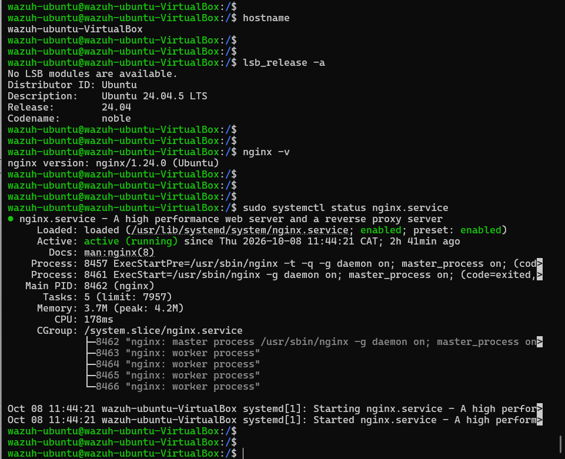
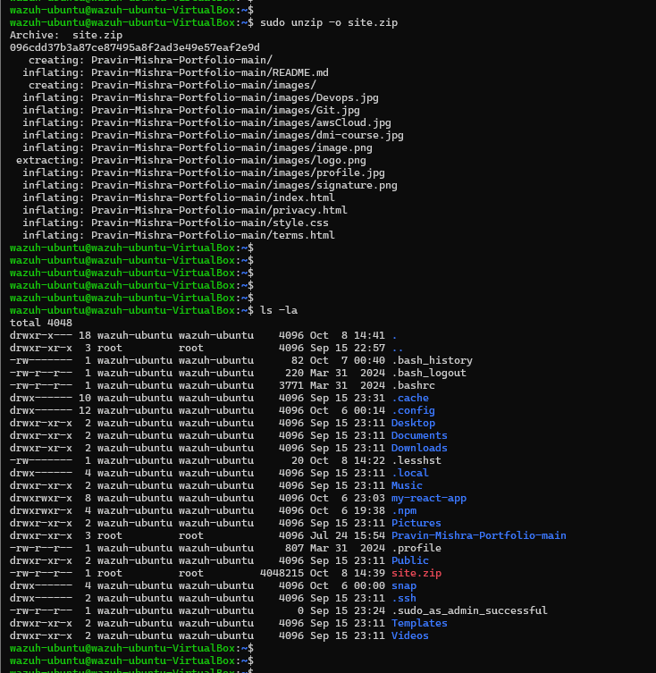
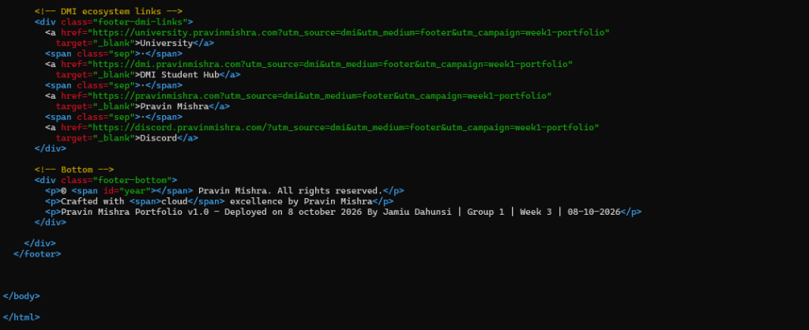
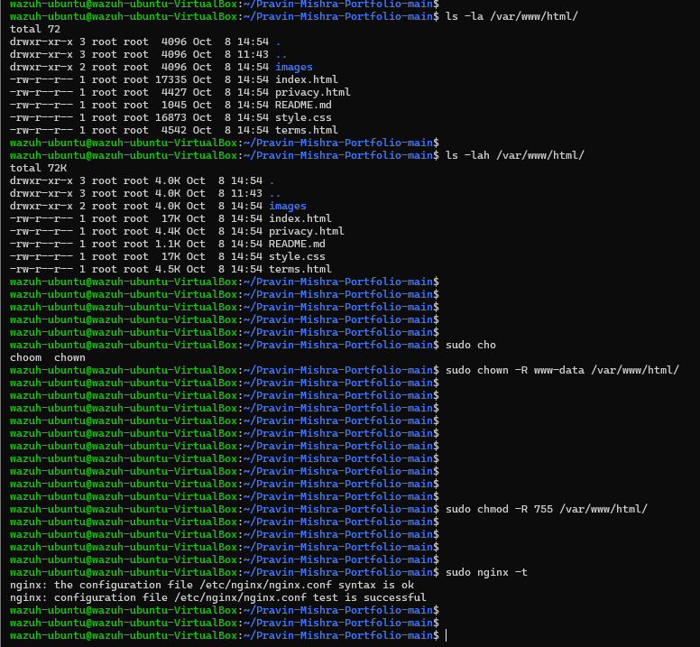
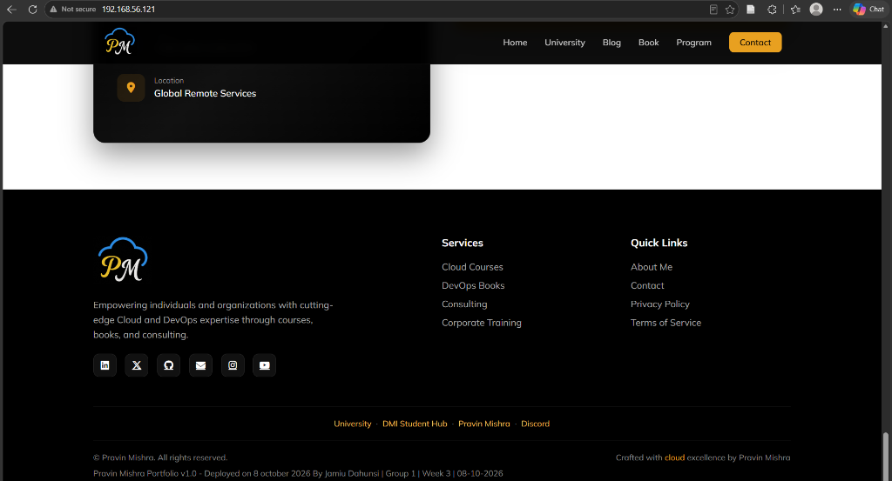
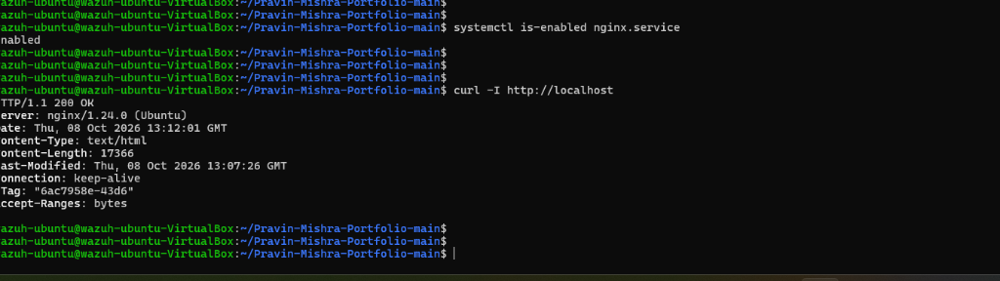

# EpicReads Portfolio Website Deployment

## Overview
This repository documents the deployment of a static HTML portfolio website on an Ubuntu Linux server using Nginx. It demonstrates foundational DevOps skills, including Linux file management, web server configuration, and deployment verification.

## Technology Stack
* Operating System: Ubuntu Linux
* Web Server: Nginx
* Content: Static HTML/CSS

## Deployment Stages

### 1. Pre-flight Check
Verified the identity of the Ubuntu Virtual Machine and confirmed the Nginx web server was actively running.

### 2. Website Source Code
Retrieved the portfolio website template directly from the source repository and extracted the files onto the server.

### 3. Ownership Proof
Modified the HTML source code to embed specific deployment credentials into the website footer to guarantee authenticity.

### 4. Nginx Deployment
Copied the modified website files into the live Nginx web root directory (/var/www/html), configured the www-data service account permissions, and validated the Nginx configuration syntax.

### 5. Live Website Verification
Verified the live website through a public web browser, confirming the Nginx server was successfully delivering the static content and the custom footer modifications.

### 6. DevOps Operational Checks
Conducted final operational checks to ensure Nginx was enabled to automatically restart on system boot and validated the local HTTP response headers.

